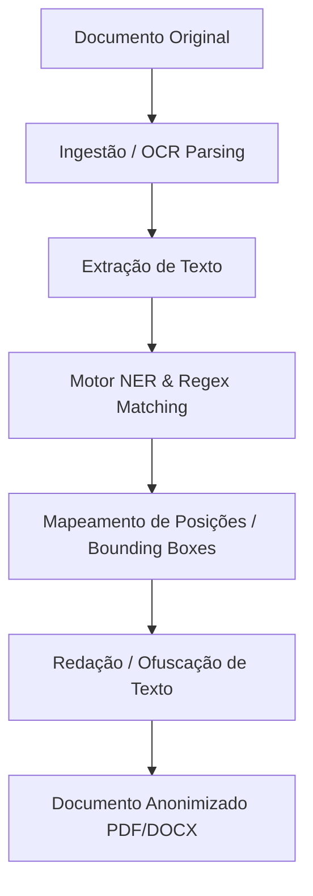

# Architecture & Processing Pipeline

O DocShield utiliza uma arquitetura modular composta por pipelines de ingestão, reconhecimento de entidades (NER) e motor de redação.

## Componentes Chave

### 1. Ingestão de Documentos (Ingestion Engine)
Suporta múltiplos formatos:
- PDF (vetorial e digitalizado via OCR)
- Microsoft Word (DOCX)
- Ficheiros de texto simples (TXT, CSV)

### 2. Reconhecimento de Entidades (NER & Regex Pipeline)
Combina regras heurísticas de expressões regulares (para NIF, IBAN, Cartão de Cidadão) com modelos de Processamento de Linguagem Natural (NLP) para reconhecer nomes próprios e moradas.

### 3. Engine de Redação
Aplica máscaras opacas ou substituição por pseudónimos mantendo a formatação visual e estrutura do documento original.
