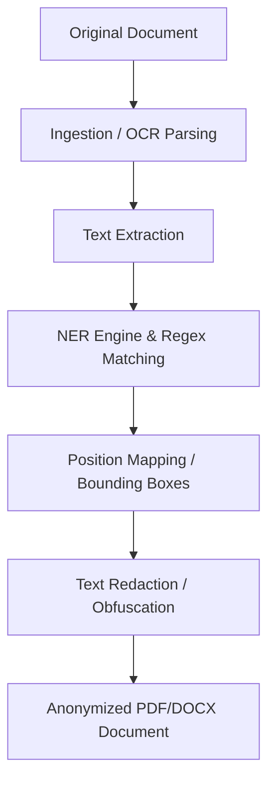

# Architecture & Processing Pipeline

DocShield uses a modular architecture consisting of ingestion pipelines, Named Entity Recognition (NER), and a redaction engine.

## Key Components

### 1. Document Ingestion Engine
Supports multiple formats:
- PDF (vectorial and scanned via OCR)
- Microsoft Word (DOCX)
- Plain text files (TXT, CSV)

### 2. Entity Recognition (NER & Regex Pipeline)
Combines heuristic regex rules (for Tax ID, IBAN, Citizen ID) with Natural Language Processing (NLP) models to identify names and addresses.

### 3. Redaction Engine
Applies opaque masks or pseudonym replacement while retaining the visual formatting and structure of the original document.

